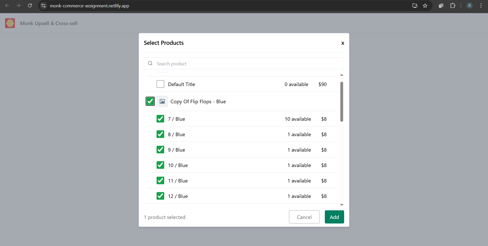

# Monk Commerce Assignment

🚀 **Monk Commerce Assignment** is a React-based application designed to streamline product selection with an intuitive and user-friendly interface. This website allows users to search for products, select variants, and manage selections efficiently.

## 🌟 Live Demo
🔗 [Monk Commerce Assignment](https://monk-commerce-assignment.netlify.app/)

## 📸 Screenshots




## ✨ Features
- 🔍 **Search Products** - Quickly find products using a search bar.
- ✅ **Select Products & Variants** - Choose individual products or specific variants with a single click.
- 🔄 **Dynamic Selection** - Displays selected products and allows modifications.
- 🔃 **Drag and Drop** - You can reorder or drag-and-drop the products. 
- 🎨 **Responsive UI** - Works seamlessly across different mobile sizes.

## 🛠️ Tech Stack
- **Frontend:** React.js, Tailwind CSS
- **Icons:** React Icons
- **API:** Fetches products from the Monk Commerce API

## 📦 Installation & Setup

1. Clone the repository:
   ```sh
   git clone https://github.com/your-username/monk-commerce-assignment.git
   ```
2. Navigate to the project folder:
   ```sh
   cd monk-commerce-assignment
   ```
3. Install dependencies:
   ```sh
   npm install
   ```
4. Start the development server:
   ```sh
   npm start
   ```

The application will run on `http://localhost:3000/`

## 🚀 Deployment
The app is deployed on Netlify. To deploy your own version:
1. Push your changes to GitHub.
2. Connect your repository to Netlify.
3. Deploy and get a live link!

## 📄 License
This project is licensed under the **MIT License**.

---

Have a great day! 🌻

